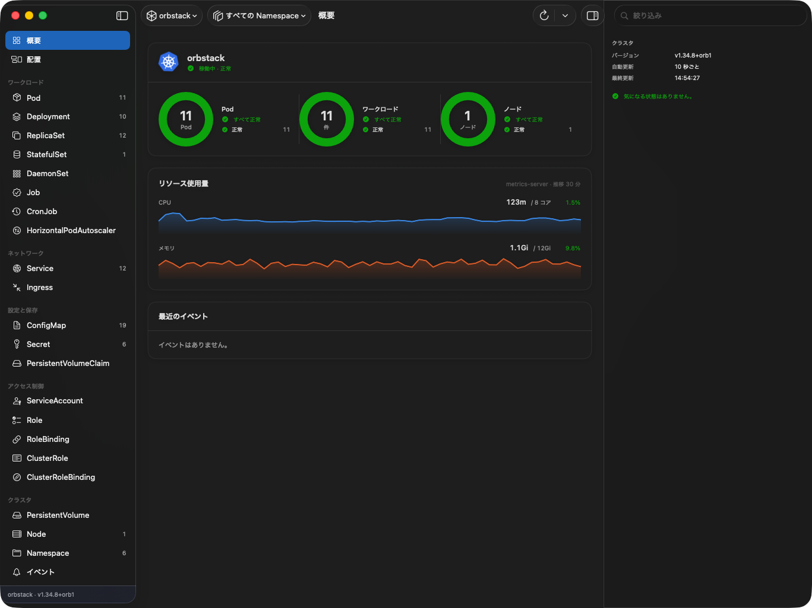
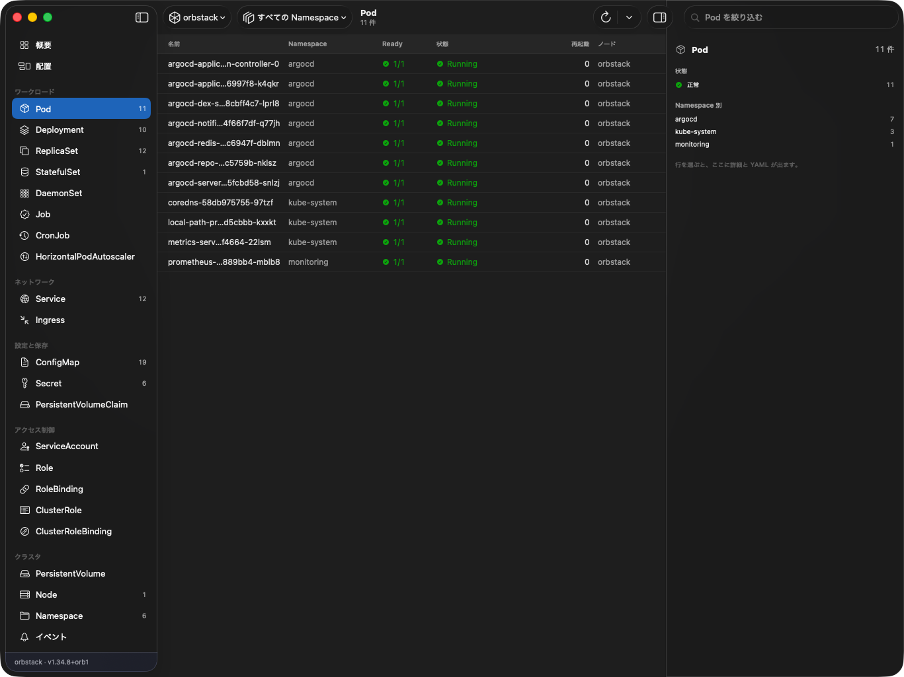
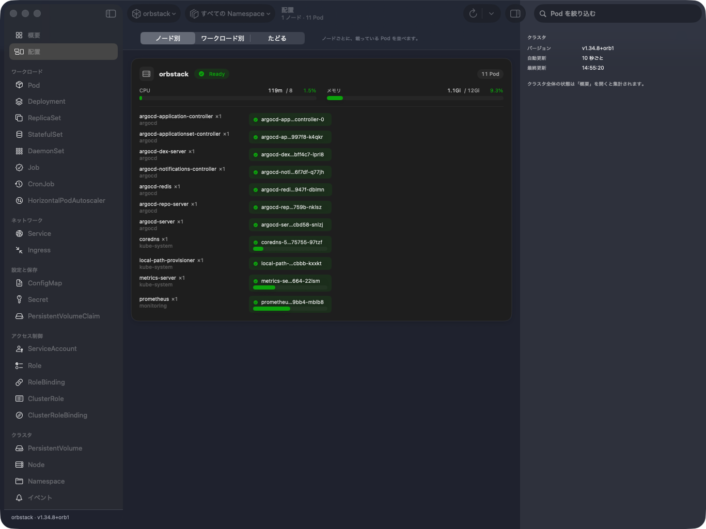
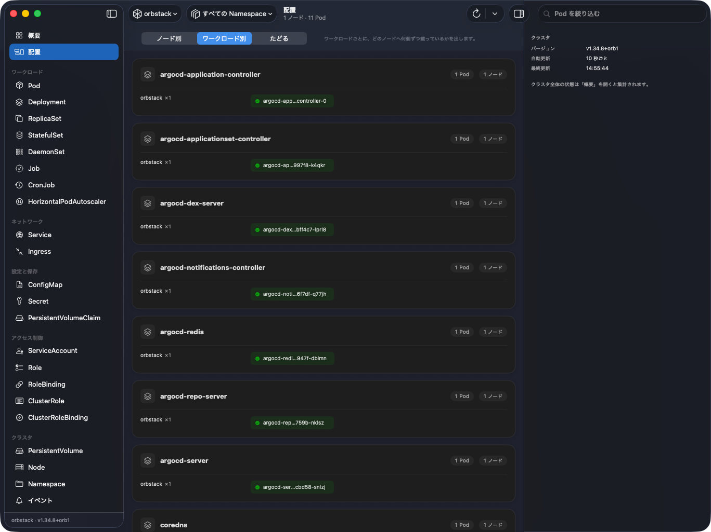
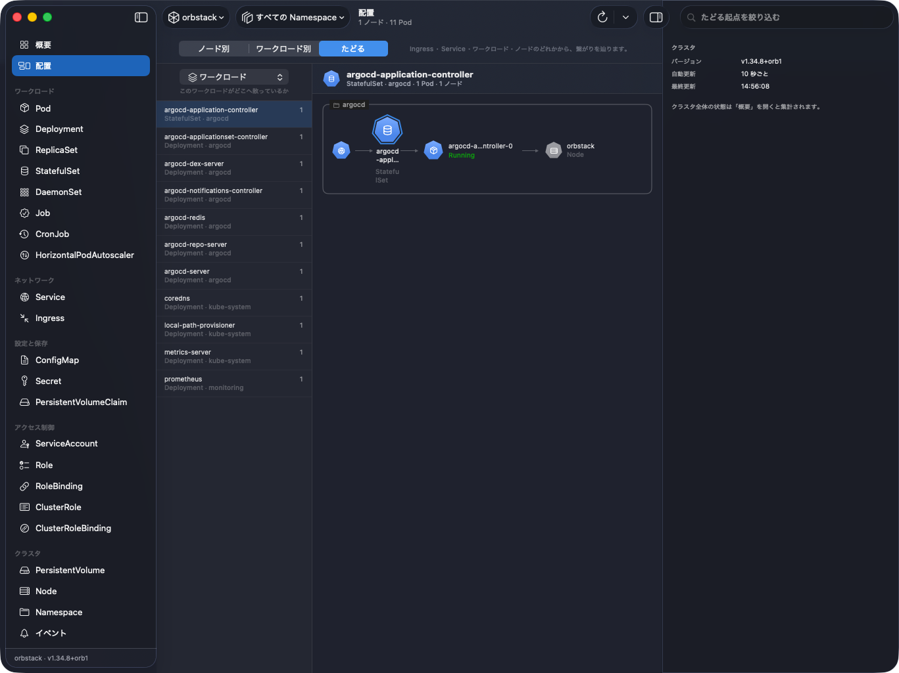

# 使い方

画面ごとの操作と、打てる文字と、つまずいたときに見る場所。入れ方は [README](../README.md) に。

画像はローカルの orbstack（k3s・ノード 1 台）に繋いだもの。

- [最初に](#最初に)
- [画面の作り](#画面の作り)
- [概要](#概要)
- [一覧](#一覧)
- [絞り込みの書き方](#絞り込みの書き方)
- [詳細パネル](#詳細パネル)
- [ログ](#ログ)
- [配置](#配置)
- [クラスタを動かす操作](#クラスタを動かす操作)
- [メトリクス](#メトリクス)
- [設定](#設定)
- [キーボードとマウス](#キーボードとマウス)
- [表示の読み方](#表示の読み方)
- [つまずいたら](#つまずいたら)

## 最初に

起動すると `~/.kube/config` の `current-context` に繋ぎにいく。接続の設定は KubeDeck 側には無い。**`kubectl` で繋がるクラスタはそのまま繋がる**（クラスタへの問い合わせは全部 `kubectl` に投げている）。

1. 左上のコンテキストのメニューで接続先を選ぶ。kubeconfig に入っているものが並ぶ。
2. その隣の Namespace のメニューで範囲を絞る。既定は「すべての Namespace」。
3. 左のサイドバーで見たいものを選ぶ。

コンテキストと Namespace の選択は次に起動したときに戻る。

うまくいかないときは [つまずいたら](#つまずいたら)。

## 画面の作り

| 場所 | 何がある |
|---|---|
| 左（サイドバー） | 概要・配置と、種別の一覧。種別は分類ごとの節に分かれ、行末に件数が出る。下端に接続中のコンテキストとサーバのバージョン |
| 上（ツールバー） | コンテキスト・Namespace・再読み込み・詳細パネルの開閉 |
| 中央 | 選んだものの本体（概要 / 配置 / 一覧） |
| 右（詳細パネル） | 選んでいる行の詳細。行を選んでいなければ一覧やクラスタの内訳 |
| 下（ログパネル） | 「ログを見る」を押したときだけ出る |
| 窓の副題 | 件数と、読み込み中かどうか |

サイドバーの節は **ワークロード / ネットワーク / 設定と保存 / アクセス制御 / クラスタ**、それに クラスタに入っている CRD が API グループごとに続く。

| 節 | 種別 |
|---|---|
| ワークロード | Pod / Deployment / ReplicaSet / StatefulSet / DaemonSet / Job / CronJob / HorizontalPodAutoscaler |
| ネットワーク | Service / Ingress |
| 設定と保存 | ConfigMap / Secret / PersistentVolumeClaim |
| アクセス制御 | ServiceAccount / Role / RoleBinding / ClusterRole / ClusterRoleBinding |
| クラスタ | Node / Namespace / PersistentVolume / Event |

出したくない種別は設定の「一般」で外せる。

**詳細パネルは行を選んでも勝手に開かない。** 出す / 畳むはツールバーのいちばん右のボタンだけが決める（選択に連動させると、左で種別を選ぶたびに窓の幅が変わる）。

## 概要

クラスタ全体の状態。カードは 3 枚。

- **状態** — Pod・ワークロード・ノードのリングと内訳。見出しはコンテキスト名と、活動（取得中 / 稼働中 / 自動更新は停止中）と全体の状態。
- **リソース使用量** — CPU とメモリ。Prometheus が見つかれば直近の推移を折れ線で、無ければ現在値を棒で出す。**折れ線と棒のどちらになるかはクラスタによる**ので、添え書きに取得元と「推移 30 分」「現在値のみ」を書いてある。
- **最近のイベント** — 直近 8 件。

種別ごとの件数はここには無い。サイドバーの行末が持っている。

読めない種別があるときは、上に「◯◯ を読む権限がありません」の帯が出る。**読めたぶんはそのまま出ている。**

## 一覧

サイドバーで種別を選ぶと出る。列は種別ごとに変わり、`kubectl get -o wide` に相当するものを並べる。

CRD は CRD 自身が宣言している表示列（`additionalPrinterColumns`）をそのまま出す。

**STATUS 列は kubectl と同じ判定**で出す。Pod は `phase` をそのまま書かないので、`CrashLoopBackOff` が `Running` と表示されることはない。

### 並べ替え

- 見出しを押すと、その列で並ぶ。
- もう一度押すと逆順。
- **3 度目で既定に戻る**（異常が上）。
- 空欄や `—` は値ではないので、昇順でも降順でも末尾に置く。
- 種別を移ると並べ替えは捨てる（列そのものが違う）。

### 選択

| 操作 | 効果 |
|---|---|
| クリック | 1 つだけ選ぶ |
| ⌘ + クリック | 足す / 外す |
| shift + クリック | 範囲で選ぶ |
| ↑ / ↓ | 1 つ動かす |
| shift + ↑ / ↓ | 選択を伸ばす |

複数選んでいるときも、詳細パネルが映すのは 1 件だけ（少し濃い行）。パネルの上にその断りが出る。

右クリックのメニューは、選んでいる数で中身が変わる。**複数選択中は 1 つ向けの操作（ログを見る、レプリカ数を変えるなど）を出さない。** できるのは名前のコピー・選択の解除・まとめて削除で、どれも件数が書いてある。

選んでいないものを右クリックすると、まずそれが選ばれる。

### 0 件のとき

「読み込み中」「取得できません」「本当に 0 件」は別の表示になる。**取得に失敗したときに「ありません」とは書かない。**

## 絞り込みの書き方

ツールバー右の欄。**空白で区切ると AND**（すべてに一致するものだけが残る）。

| 打つもの | 意味 |
|---|---|
| `nginx` | 名前・Namespace・ラベル・各セルの文字を横断して部分一致 |
| `app=nginx` | ラベル `app` の値が `nginx`（**完全一致**） |
| `app=` | ラベル `app` を持っている |
| `ns:kube-system` | Namespace（`namespace:` でも可） |
| `status:CrashLoopBackOff` | STATUS 列の文字（`state:` でも可） |
| `node:node-a` | 載っているノード |

ラベルの値が完全一致なのは、`env=prod` が `env=production` を拾うと絞り込んだつもりで絞れていないため。セレクタの語彙なのでこちらが正しい。

**本物のラベルセレクタは実装していない。** `in (a,b)`・`notin`・`!key` は効かない。

`nginx:1.21` のように知らない語 + `:` を打ったものは、場所の指定ではなく素の文字として扱う。

書き方は、一致するものが無かったときに画面に出る。

## 詳細パネル

行を選ぶと 4 つのタブが出る。

| タブ | 中身 |
|---|---|
| 概要 | 基本情報・使用量・推移・コンテナ・条件・ラベル |
| イベント | **選んでいるものだけ**のイベント。サーバ側で uid で絞って引き直している |
| 設定 | 種別ごとに項目を選んだ表。API のフィールド名ではなく日本語の見出しで、未設定の項目も「未設定」と薄く並ぶ |
| YAML | `kubectl get -o yaml` そのまま |

**状態の「なぜ」はイベントタブにある。** 一覧の STATUS 列も概要のリングも「異常である」ことまでしか言わない。`Pending` の理由（`FailedScheduling: insufficient cpu`）や `CrashLoopBackOff` の発端（`Failed to pull image`）はイベントにしか出ない。

イベントは自動更新に載せていない。取り直すのはパネルの「再読み込み」を押したとき。0 件のときは「消えた可能性がある」ことも併せて書く（イベントはクラスタの既定で 1 時間で消える）。

設定タブは Secret の中身を出さない（キー名と大きさまで）。スキーマの分からない CRD だけは木で出す。

行を選んでいないときは、一覧の内訳（状態と Namespace）かクラスタの要約が出る。

## ログ

Pod か Job を右クリック →「ログを見る」、または詳細パネルの見出しの「ログ」ボタン。**行を選んだだけでは開かない。**

**Job は Pod に潰さずに開く。** Job の Pod は再試行や `completions` で複数になるので、開いてから Job 自身のセレクタで引き、複数あれば上の「Pod」メニューで選ぶ。**Pod が見つからないことは失敗と分けて出す** — 完了した Job の Pod はガベージコレクションで消え、ログも一緒に消えるので、「引けなかった」ではなく「もう残っていない」と書く。

一覧の下にパネルが出る。仕切りを掴むと高さが変わり、開いたまま一覧を操作できる。並べて比べたいときは「別ウインドウ」（右クリックの「ログを別ウインドウで見る」でも同じ）。

| 操作 | 何が変わる |
|---|---|
| 追いかける | `kubectl logs --follow` を付けるか。**取得そのものの話。** 切ると、いま出ている範囲まで読んで終わる |
| 末尾へ送る | 新しい行が来たら末尾までスクロールするか。**見え方だけの話。** 切っても取得は続くので、遡って読んでも行は消えない |
| 折り返し | 長い行を折り返す。切ると横スクロール |
| その他 | 時刻を出す / 前回の起動のログ（`--previous`）/ 表示中の行をコピー |
| 行を絞り込む | 一致した部分に色が敷かれる |

コンテナが複数ある Pod は左のメニューで切り替える。Job のときは、その前に Pod のメニューが並ぶ。

行頭の 2pt の帯が深刻度。klog（`E0802`）、JSON（`"level":"error"`）、logfmt（`level=error`）、括弧（`[ERROR]`）を見る。**本文の色は変えない。**

上限（既定 5,000 行）を超えると古いほうから捨てる。捨てたときは下の帯にその旨が出る。行数は設定の「ログ」で変えられる。

パネルは、開いているあいだ一覧の選択に追従する。✕ で閉じれば止まる。追従したくないときは設定の「ログ」で切る。

## 配置

どの Pod がどのノードに載っているか。上の切り替えで見方が 3 つある。**どれも代わりが無い。**

| 見方 | 答える問い |
|---|---|
| ノード別 | このノードは混んでいるか |
| ワークロード別 | どれがどこに散っているか。集中しているものを**まとめて**見つける |
| たどる | この 1 つはどう繋がっているか（入口 → ワークロード → 世代 → Pod → ノード） |

**ノード別** — ノードが箱、Pod がタイル。Pod が 0 のノードも出る（受け入れ先が空いていることが見えなくなるため）。スケジュールされていない Pod は最後に「未スケジュール」としてまとめる。ノードの箱には CPU とメモリの棒が付く。

**ワークロード別** — ワークロードが箱で、中がノードで割れる。2 つ以上あるのに 1 つのノードに全部載っているものは、文字で断って先頭に出る。レプリカ 1 のものは散らしようがないので警告にしない。

**たどる** — 左で起点を 1 つ選ぶ。起点は **ワークロード / ReplicaSet・Job / Service / Ingress / ノード** の 5 種類から選べて、どれを選んでも図は同じ鎖になる。図の中の器も押せて、押した先が次の起点になる（「戻る」で 1 つ前に帰れる）。Pod のタイルを押すと右のパネルにその Pod が出る。

辿れなかったこと（Ingress が指している Service が無い、Service が何も掴んでいない）は文字で断る。

タイルの大きさ・ノードの並び・棒が表すもの・ワークロードでまとめるか・Pod が 0 のノードを隠すかは、設定の「一般」にある。**小さいタイルは名前を出さない**（数百の Pod を名前つきで並べると、どこに寄っているかという肝心の絵が見えなくなる）。名前と状態と使用量はタイルを指すと出る。

絞り込み欄は、ノード別・ワークロード別では Pod を、たどるでは左の起点の一覧を絞る。

## クラスタを動かす操作

一覧の右クリックから。**押した瞬間には効かない。** どれも何が起きるかを書いた確認を挟む。

| 操作 | 対象 | 注意 |
|---|---|---|
| 削除 | Event 以外 | 取り消せない。まとめて削除もできる |
| レプリカ数を変える | Deployment / StatefulSet / ReplicaSet | HPA 管理下かを開いたときに調べる |
| ローリング再起動 | Deployment / StatefulSet / DaemonSet | 入れ替わっているあいだ処理は中断される |
| cordon / uncordon | Node | **いま載っている Pod はそのまま動き続ける** |
| drain | Node | 実行前に `--dry-run=server` で結果を出す |

**cordon と drain は別物。** cordon は「新しい Pod が置かれなくなる」だけで、退避はしない。退避は drain。

**drain** のシートには 2 つのトグルがあり、どちらも既定は切ってある。

- `emptyDir の中身を捨ててよい` — そのノード上のディスクにしかないデータは失われる。
- `管理されていない Pod も消す` — ReplicaSet などに属さない Pod は、消すと作り直されない。

既定のままだと drain が止まることがあるが、**止まるほうが黙って消すよりよい。** 止まる場合は kubectl が返した理由がそのままシートに出る（どのトグルが要るかはそこに書いてある）。

**レプリカ数**を変えるとき、その対象を HPA が管理していれば「次の調整で HPA が戻します」と最小 / 最大つきで出る。止めはしない（調整を待たずに増やす、いったん 0 にする、はどれも正当な操作）。

操作が通ると、下に数秒だけ丸い札が出る。**やったことより多くは言わない** — 要求を投げただけのものは「削除を要求しました。消えるまで少しかかります」と書く（削除は行がしばらく `Terminating` で残るので、無言だと押せていないように見える）。

## メトリクス

取得元は 2 つあり、持ち場が違う。

| 取得元 | 出るもの |
|---|---|
| metrics-server | いまの値。Pod と Node の一覧の CPU / メモリ列、概要の使用量、詳細パネルの使用量 |
| Prometheus | 推移。スパークラインと概要の折れ線 |

**入っていなければ、その部分を出さないだけ。** 空の列や 0 は並べない（値が 0 なのか取れていないのか区別が付かなくなる）。値が引けないセルは `—`。

Prometheus は API サーバのプロキシ経由で叩くので **port-forward は要らない**。Thanos / VictoriaMetrics のような互換のものも、`/api/v1/query` が Prometheus 互換の応答を返せば使える。自動で見つからないときは設定の「メトリクス」で手で指定できる。

使用率の分母は場所で違う。**何を分母にしているかは画面に書いてある。**

| 対象 | 分母 |
|---|---|
| ノード | allocatable（capacity ではない。システム予約は Pod が使えない） |
| Pod | limits。無ければ requests |

上限が無い Pod には色を付けない（超える先が無いので、要求比で赤くしても意味が無い）。要求は棒の上の目盛りで示す。requests も limits も未設定なら「未設定」と書いて橙で出す。

## 設定

⌘, で開く。タブは 5 つ。

| タブ | 主なもの |
|---|---|
| 一般 | 起動時に開く画面（前回の続き / 概要）、サイドバーの件数・CRD・0 件の種別、**出す種別の取捨選択**、一覧の行の詰め方、配置の見え方、すべて既定値に戻す |
| ログ | 選択への追従、開いたときの既定（追いかける / 折り返し / 時刻）、遡って読む行数、画面に残す上限 |
| メトリクス | 取得元（自動 / metrics-server / Prometheus）、推移の範囲と取り直す間隔、使用率のしきい値、検出結果と再検出、Prometheus の手動指定 |
| 接続 | 自動更新と間隔、kubectl の待ち上限、kubectl の場所、**子プロセスに渡している PATH と環境** |
| 更新 | いまの版、最後の確認、自動で確認するか・間隔・先にダウンロードするか |

「すべて既定値に戻す」を押しても、接続先のコンテキストと Namespace の選択は残る。

取得元に metrics-server か Prometheus を選び、それが使えないときは、**黙って別の先へ流さずに理由を出す**（どちらの数字を見ているのか分からなくなるため）。

## キーボードとマウス

| 操作 | 効果 |
|---|---|
| ⌘R | 再読み込み |
| ⌘, | 設定 |
| ↑ / ↓ | 一覧の選択を動かす |
| shift + ↑ / ↓ | 選択を伸ばす |
| ⌘ + クリック | 選択に足す / 外す |
| shift + クリック | 範囲で選ぶ |
| 見出しをクリック | 並べ替え（3 度目で既定に戻る） |
| 右クリック | 操作のメニュー |
| ログパネルの仕切りをドラッグ | 高さを変える |

自動更新の切り替えと間隔（5 / 10 / 30 / 60 秒）は、ツールバーの再読み込みボタンのメニューか、メニューバーの「表示」から。

## 表示の読み方

この画面がいちばん気を遣っているのは、**「無い」と「取れていない」を混ぜない**ことにある。読むときも同じ区別で読める。

| 出ているもの | 意味 |
|---|---|
| `0 件` / `ありません` | 確かめたうえで無い |
| `取得できません` | 引けなかった。件数は分からない |
| `—`（メトリクスの列） | 値が取れていない。0 ではない |
| `未設定`（設定タブ・使用量） | 項目が無い。0 が設定されているのとは違う |
| `<unknown>` を出す HPA の列 | 指標が取れていないので **HPA は何もしていない**。使用率 0% ではない |
| 「◯◯ を読む権限がありません」の帯 | その種別だけ読めていない。他は出ている |

状態の色は 4 段（good / warning / serious / critical）。**色だけで意味を運ばせない**ので、必ずアイコンか文字と組で出る。

ツールバーと概要の見出しの Kubernetes ロゴは、回転が稼働の合図。取得中は速く、自動更新が生きているあいだはゆっくり右回りに回り、自動更新を切ると止まる。異常があるときだけ隅にしるしが付き、同じ内容が文字でも出る。

## つまずいたら

### 起動できない・「開発元を検証できない」

配布物は ad-hoc 署名で公証を通していないので、初回だけ隔離属性を外す。手順は [README](../README.md#入れる)。

### 「クラスタに接続できません」

kubectl そのものが見つかっていない。設定の「接続」→「いま使っている kubectl」で解決結果が見られる。Homebrew・krew・gcloud SDK の場所は自動で探すが、それ以外に入れている場合は同じ画面で手で指定する。

### ターミナルでは通るのに、アプリからは通らない

kubeconfig の exec 認証プラグイン（GKE の `gke-gcloud-auth-plugin`、EKS の `aws`）が見つかっていないことが多い。設定の「接続」に、**子プロセスに渡している PATH と環境**を出してある。まずそこにプラグインの置き場所と必要な変数が届いているかを見る。

- TLS を覗くプロキシの下なら `REQUESTS_CA_BUNDLE` / `SSL_CERT_FILE`
- gcloud なら `CLOUDSDK_` で始まるもの

鍵やトークンに見える値は伏せてあるが、**場所を指す値は残してある**（CA の指し先が合っているかを見る場所なので）。

### エラーの帯が出た

原因と対処の決まっている失敗には、日本語の説明が頭に足される。**元の文言は「元の文言」に畳んである**ので、当てはまらなかったときはそちらを開く。「コピー」で全文を貼れる。

とくに紛らわしい 2 つ。

- **証明書を検証できない**（`CERTIFICATE_VERIFY_FAILED`）は認証の失敗ではない。資格情報は正しく、検証で落ちている。`gcloud auth login` をいくら実行しても直らない。
- **API サーバに届かない**（`Unable to connect`）も認証の失敗ではない。認証が通っているからこそ、そこまで来て接続で落ちている。宛先が private なら VPN や社内ネットワークが要る。

### 読み込み中のまま止まる

到達できないコンテキストを選んでいる可能性がある。kubectl の待ち上限は設定の「接続」で変えられる（遅い回線越しのクラスタでは長めに）。

### 種別が一覧に出ない

3 つ考えられる。

1. 設定の「一般」→「出す種別」で外している。
2. 「件数が 0 の種別を隠す」を入れていて、実際に 0 件。
3. その種別を読む権限が無い。この場合は画面に帯が出る。

### メトリクスの列が出ない

metrics-server が入っていないか、引けていない。設定の「メトリクス」→「このクラスタで使えるもの」で検出結果が見られる。「もう一度探す」で調べ直せる。

**取得元はあるのにノードの使用量だけ引けない**ことがある（管理されたクラスタでは、ノードの指標を拒みつつ Pod の指標は通すことがある）。そのときは使用量カードにその旨が書かれる。

### 推移の折れ線が出ない

推移は Prometheus からしか出ない。metrics-server は履歴を持たないため。自動で見つからないときは設定の「メトリクス」→「Prometheus を手で指定する」で、Namespace・Service 名・ポートを入れて「確認して使う」。ポートは Service のポート番号（port-forward は不要）。
